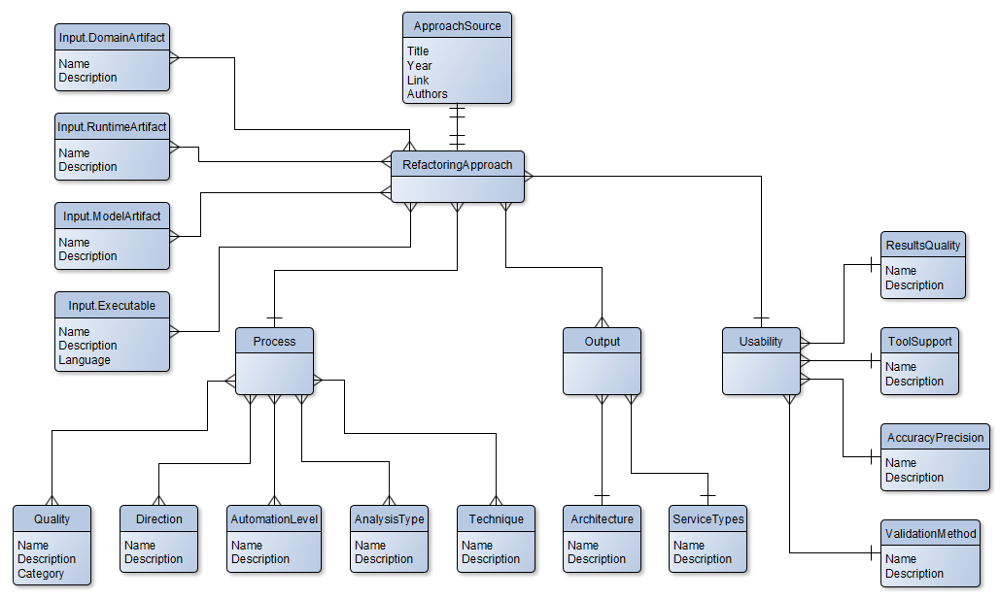

# Architecture Refactoring Helper

The Architecture Refactoring Helper is an application which aims to help find suitable migration approaches to microservices architecture.

## Running the application in Docker

### Requirements

- Docker

### Starting the application

1. Navigate to "{RepositoryFolder}" via Console
2. Run "docker-compose build" (only needed on first startup or if code changed were made)
3. Run "docker-compose up"

## Using the application

After starting the docker containers the API can be reached at "https://localhost:5000/api/v1" and User interface at "https://localhost:9000/"

## Running the Backend

### Requirements

- [.NET 6 SDK](https://dotnet.microsoft.com/en-us/download/dotnet) - if running without Docker
- Docker - if running in Docker

### Starting the application

- Running through IDE
    1. Open "ArchitectureRefactoringHelper.sln" in "{RepositoryFolder}/ArchitectureRefactoringHelper" Folder
    2. Run "Repository" Project
- Running through Console
    1. Navigate to "{RepositoryFolder}/ArchitectureRefactoringHelper/Repository"
    2. On first startup run "dotnet restore"
    3. Run "dotnet run"
- Running in Docker container
    1. Navigate to "{RepositoryFolder}/ArchitectureRefactoringHelper/Repository"
    2. Run "docker build -t {ImageTag} ."
    3. Run "docker run -p 5000:5000 {ImageTag}"

### Using the application

#### Without Docker
After starting the app the API will run on "https://localhost:7262/api/v1" and the swagger UI can be reached at "https://localhost:7262/swagger/index.html"

#### With Docker
After starting docker container the API can reached at "https://localhost:5000/api/v1"

## Running the User interface

### Requirements

- [node.js](https://nodejs.org/en/download) - if running without Docker
- [Angular CLI](https://angular.io/cli) - if running without Docker
- Docker - if running in Docker

### Starting the application

- Running through WebStorm
    1. Open "{RepositoryFolder}/UI" Folder
    2. Run application
- Running through Console
    1. Navigate to "{RepositoryFolder}/UI"
    2. On first startup run "npm install"
    3. Run "ng serve"
- Running in Docker container
    1. Navigate to "{RepositoryFolder}/UI"
    2. Run "docker build -t {ImageTag} ."
    3. Run "docker run -p 9000:9000 {ImageTag}"

### Using the application

#### Without Docker
After starting the app the user interface can be reached on "https://localhost:4200"

#### With Docker
After starting docker container the user interface can reached at "https://localhost:9000/api/v1"

## Data model

The data model behind this application is modeled in the following Entity-Relationship-Dragram:

TODO
